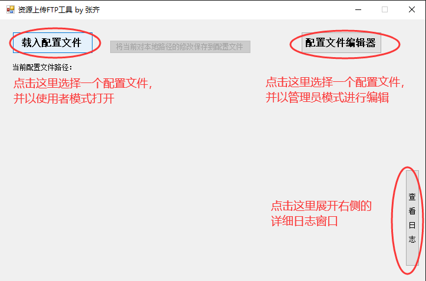
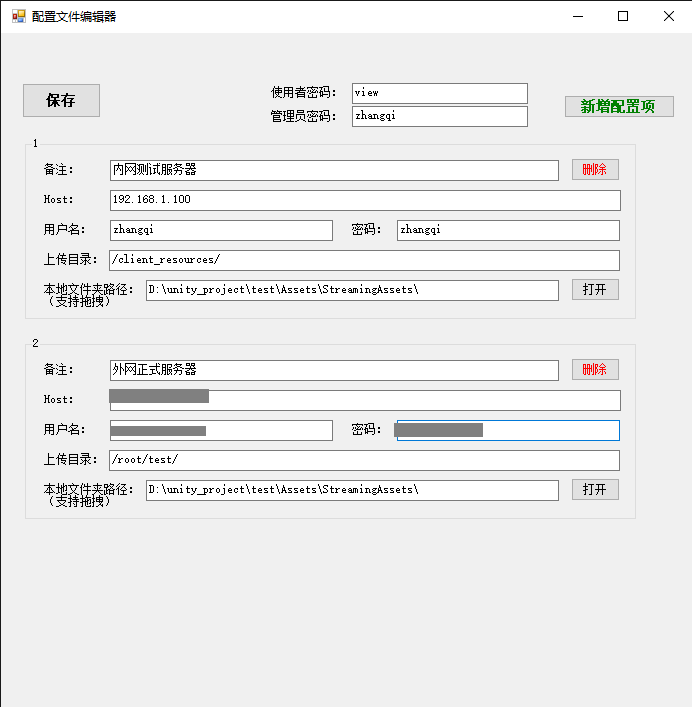
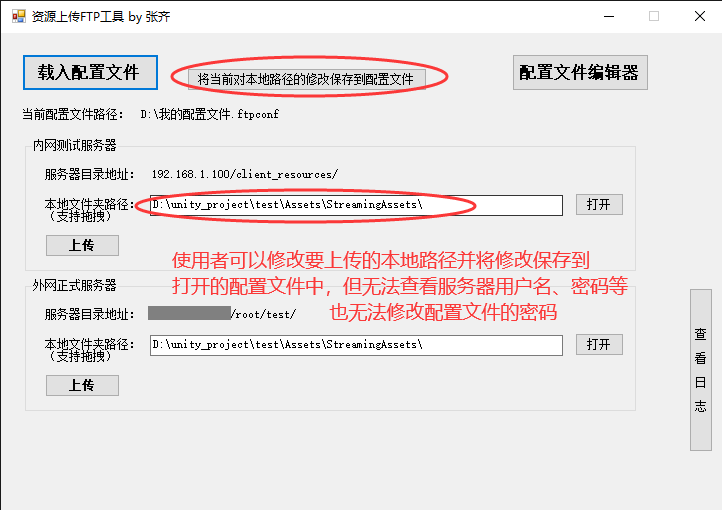
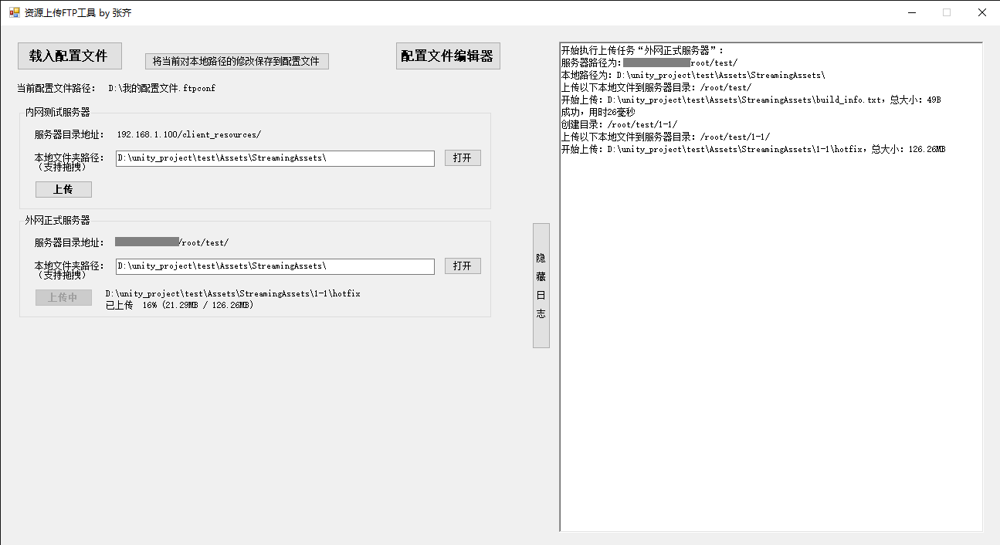
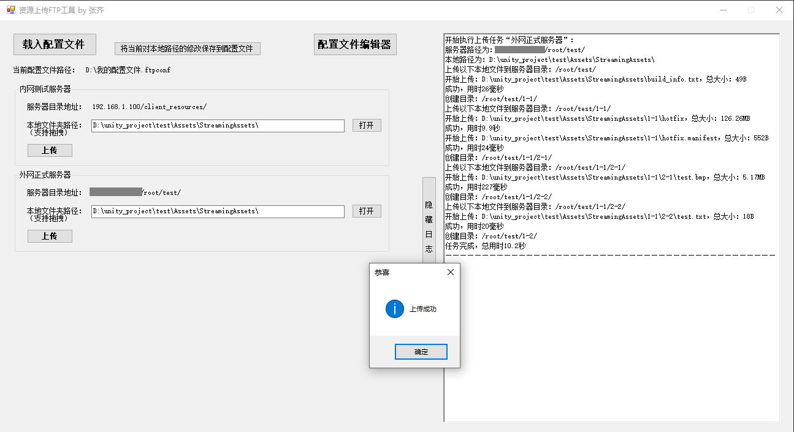

# UploadFilesToServerTools

 一键将指定文件夹中资源（如游戏热更新资源、网站资源）传到资源服务器的工具软件（可自由修改保存配置）。

1. ## 软件概述

   在游戏或网站等开发中，开发人员经常需要将新的资源上传到服务器中，如果每次都要交由服务器管理员上传，无疑会降低工作效率。服务器管理员通过本软件提供的可视化界面配置各个服务器上传路径并存储为配置文件，然后将配置文件发给开发人员，开发人员通过载入配置，就可以一键实现资源的上传。

2. ## 名词说明

   ### “管理员密码”

   服务器管理员在编辑配置文件时，设定“管理员密码”，该密码仅管理员自己知道，用于再次编辑此配置时鉴权。在不知道该密码的情况下，无法编辑配置文件。

   ### “使用者密码”

   服务器管理员在编辑配置文件时，设定“使用者密码”，并将该密码告知允许上传的开发人员，开发人员凭借此密码可以载入配置文件并进行上传，但无法查看敏感信息（服务器用户名、密码）

3. ## 注意事项

   文件传输采用基于SSH的SFTP协议。

   上传时，会自动根据本地目录结构在服务器目录中创建不存在的目录，服务器中已有的同名文件会被覆盖。

4. ## 软件使用教程

   ### 主界面

   

   ### 服务器管理员新建、编辑配置界面

   

   注意事项：

   Host填写服务器域名或IP，传输采用基于SSH的SFTP协议，端口号22无需指定且无法修改。

   管理员在该界面中，可以不设置本地文件夹路径，其他参数都必须填写。

   保存配置文件时，会自动将填写的Host末尾的“/”或“\”去掉。

   保存配置文件时，会自动将服务器路径中的“\”替换为“/”，开头和末尾都会被加上“/”。

   保存配置文件时，会自动将本地路径中的“/”替换为“\”，末尾会被加上“\”。

   ### 开发人员载入、修改管理员提供的配置文件

   

   ### 开发人员确认上传资源到服务器

   上传中可以实时查看当前正在上传文件的传输进度，在日志窗口中也可以看到每个文件上传的详情。

   

   